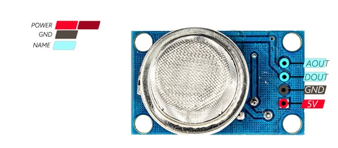
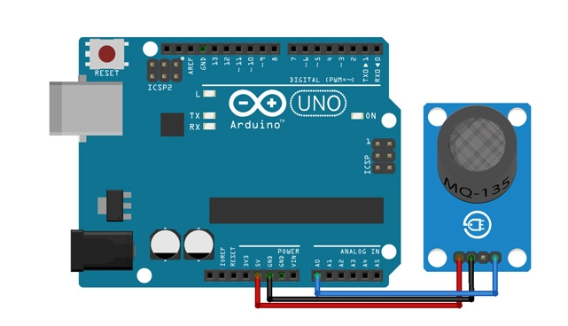

# Gas Concentration Monitoring with MQ-135 and MQ-2 Sensors
This Arduino sketch reads the gas concentration of CO2 and LPG (Liquified Petroleum Gas) values from two sensors, the [MQ-135](https://github.com/RobotnikAutomation/mq_gas_sensors/blob/main/Datasheets/MQ135_datasheet.pdf) and [MQ-2](https://github.com/RobotnikAutomation/mq_gas_sensors/blob/main/Datasheets/MQ2_datasheet.pdf), and then communicates the values to ROS using the following libraries:

- [MQUnifiedsensor by Miguel Califa](https://github.com/miguel5612/MQSensorsLib) to interface with the MQ-135 and MQ-2 sensors.
- [Rosserial Arduino Library by Michael Ferguson](https://github.com/frankjoshua/rosserial_arduino_lib) to communicate the values to ROS.

The sketch publishes the gas concentration values to two ROS topics: `mq135_CO2` and `mq2_GLP`.

### 1. Hardware
 
The following hardware is required to run this sketch:

- Arduino board (e.g. Uno).
- MQ-135 and MQ-2 sensor modules.
- Jumper wires to connect the sensor modules to the Arduino.
- USB cable to connect the Arduino board to the device running ROS.

### 2. Prerequisites

Before you can use this sketch, you need to install the following software:

- [Arduino IDE](https://www.arduino.cc/en/Main/Software) to upload the sketch to the Arduino board.
- [ROS](http://wiki.ros.org/Installation) to receive the gas concentration values.
- [rosserial](http://wiki.ros.org/rosserial) ROS package to establish a connection between ROS and the Arduino.

To install the rosserial package, open a terminal and run the following command:

```
sudo apt-get install ros-<rosdistro>-rosserial
sudo apt-get install ros-<rosdistro>-rosserial-arduino
```
Replace <rosdistro> with the name of your ROS distribution (e.g. melodic, noetic).

### 3. Installation

  To use this sketch, follow these steps:
  
0. At first launch, the so-called "burn-in" (or preheat) procedure must be performed by leaving the sensor working for 12-24 hours in a room with clean air.

1. Connect the MQ-135 and MQ-2 sensor modules to the Arduino using jumper wires. The specific connections will depend on the modules and the Arduino board you are using.

    - Connect the Vcc (5 V) and GND pins of each sensor to the 5V and GND pins of the Arduino board, respectively.
    - The code is implemented so that the analog input A0 of the Arduino board is connected to the analog output (AOUT) of the MQ-135 sensor, while the analog input A1 is connected to the analog output (AOUT) of the MQ-2 sensor.
    
<p align="center">
  
  
  <br>
  <strong>Figure 1. MQ-135 gas sensor module pins and wiring</strong>
</p>

2. Connect the Arduino board to the device running ROS using a USB cable type A/B.

3. Download and install the required libraries: MQUnifiedsensor and Rosserial Arduino Library. You can download them directly in the Arduino IDE.

4. Open the sketch in the Arduino IDE and upload it to the Arduino board. You may have to try to upload it multiple times in case of error.

5. Close the Arduino IDE. In two separate terminal windows, run the following commands:

```
(Terminal 1) roscore
(Terminal 2) rosrun rosserial_python serial_node.py _port:=/dev/ttyUSB0 _baud:=57600
```
Replace /dev/ttyUSB0 with the correct serial port for your setup (e.g. /dev/ttyACM0) and replace 57600 with the correct baud rate (e.g. 9600, 115200).

### 4. Usage

Once the sketch is running on the Arduino and you have set up the ROS environment, you can start monitoring the gas concentration values. The values will be published to two ROS topics: `mq135_CO2` and `mq2_GLP`. With the following commands you can view the values in real time:

```
(Terminal 3) rostopic echo mq135_CO2
(Terminal 4) rostopic echo mq2_GLP
```
Note that each sensor has the ability to detect multiple gases, so when there is a mixture of gases present, the readings represent the sum of the concentrations of all the gases, and it is not possible to determine the specific concentration of each individual gas.

### 5. Troubleshooting

If you are having trouble getting the sketch to work, here are a few things to check:

- Make sure the Arduino is connected to your computer and the correct port is selected in the Arduino IDE.

- Make sure the USB cable is securely connected between the Arduino board and the device running ROS.

- Make sure the required libraries (MQUnifiedsensor and Rosserial Arduino Library) are installed and included in the sketch.

- Check the connections between the sensor modules and the Arduino. Make sure they are correct and secure.

- If you are using the MQ-135 sensor, make sure it has warmed up for at least 20 minutes before taking readings.

- If you are using the MQ-2 sensor, make sure it is not exposed to open flames or high temperatures, as this can damage the sensor.

### 6. References

Aksoy, M. Ç. (2022). _NodeMcu ROS Project_ [C++]. https://github.com/mcagriaksoy/ros_nodemcu_rosserial_sensor (Original work published 2020)

Anavi, L. (2019). _How to Use MQ-135 Gas Sensor? ANAVI Technology_. https://blog.anavi.technology/?p=56

Califa Urquiza, M. Á. (2023). _MQSensorsLib_ [C++]. https://github.com/miguel5612/MQSensorsLib (Original work published 2019)

Frank, J. (2022). _ROS Serial Arduino Library_ [C++]. https://github.com/frankjoshua/rosserial_arduino_lib (Original work published 2017)

Gironi, D. (2017). Davide Gironi: MQ gas sensor correlation function estimation by datasheet. _Davide Gironi_. http://davidegironi.blogspot.com/2017/05/mq-gas-sensor-correlation-function.html

Khondaker, M. K. (2018). _Arduino And MQ 135 Gas Sensor With Arduino Code_. https://projecthub.arduino.cc/m_karim02/0385af2f-f3f0-47b4-b93d-07141e7472c0

Kumar, A. (2020). _How to use Arduino with Robot Operating System (ROS) | Arduino_. Maker Pro. https://maker.pro/arduino/tutorial/how-to-use-arduino-with-robot-operating-system-ros
